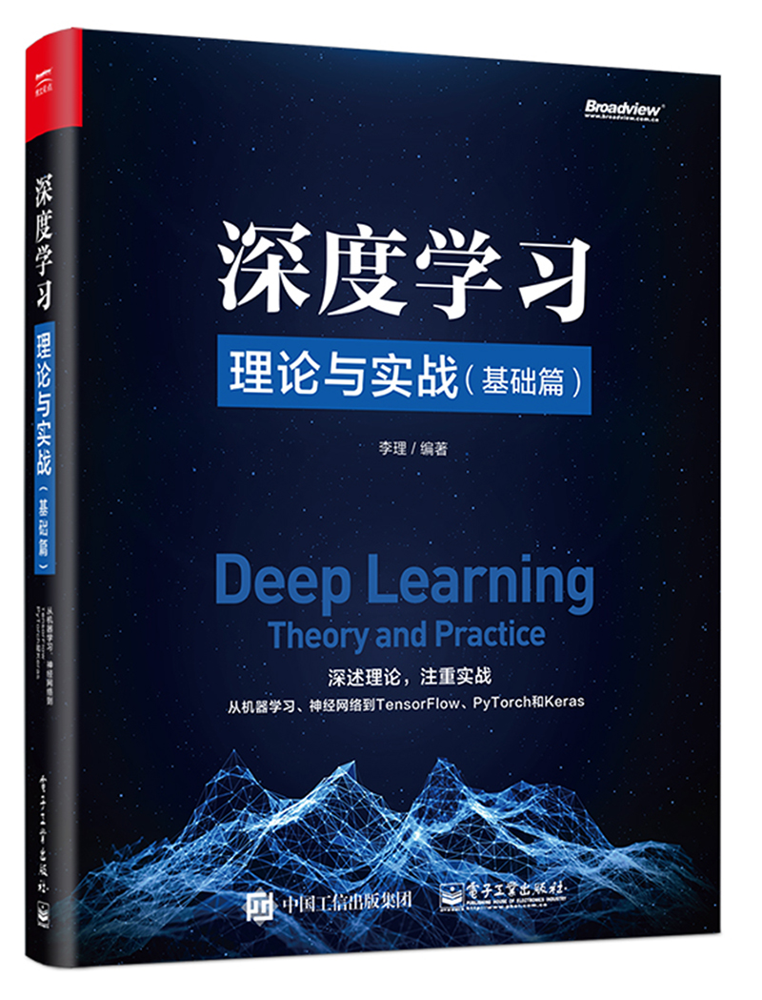

# 《深度学习理论与实战：基础篇》

目前在京东的电子工业出版社的[官方旗舰店](https://item.jd.com/51463819210.html)有售。

本网站是电子工业出版社出版的《深度学习理论与实战：基础篇》的相关资料，包括随书源代码、补充资料和勘误表等内容。
### [《深度学习理论与实战：提高篇》](https://fancyerii.github.io/2019/03/14/dl-book/)

基础篇的姊妹篇，免费开放。涵盖听觉、视觉、语言和强化学习四大领域，深入浅出的理论分析和详尽的代码分析。

## 代码

请用git clone或者http下载本repo，然后进入相应的章节目录，比如第一章的代码在src/ch1

### [第一章](src/ch1)
### [第二章](src/ch2)
### [第三章](src/ch3)
### [第四章](src/ch4)
### [第五章](src/ch5)
### [第六章](src/ch6)

## 补充材料
### 第一章
[xgboost简介](https://fancyerii.github.io/books/xgboost)
### 第二章
[自动求导](https://fancyerii.github.io/books/autodiff/)

### 第三章
[Tensorflow简介](https://fancyerii.github.io/books/tf-for-cnn)，为了便于读者理解，作者先介绍了CNN、RNN等模型之后再介绍Tensorflow和PyTorch等工具。但是为了在介绍理论的同时也能了解它的基本用法，所以在这一章就需要读者了解基本的Tensorflow用法了，这就造成了"循环依赖"。因此这里的内容和后面的章节有一些重复，出版时把这部分去掉了，但是读者如果不了解Tensorflow的基本用法，可能无法了解本章的代码，所以建议没有Tensorflow基础的读者阅读一下这部分的内容。

### 第四章

[用Numpy实现vanilla RNN](https://fancyerii.github.io/books/rnn-codes/)，这个补充材料介绍怎么使用Numpy(而不借助其它深度学习框架]实现最简单的RNN，并且用这个RNN来训练莎士比亚风格的语言模型。通过这个材料，读者可以了解到RNN前向技术的具体步骤。

[PyTorch简介](https://fancyerii.github.io/books/pytorch-for-rnn/)，为了便于读者理解，作者先介绍了CNN、RNN等模型之后再介绍Tensorflow和PyTorch等工具。但是为了在介绍理论的同时也能了解它的基本用法，所以在这一章就需要读者了解基本的Tensorflow用法了，这就造成了”循环依赖”。因此这里的内容和后面的章节有一些重复，出版时把这部分去掉了，但是读者如果不了解PyTorch的基本用法，可能无法了解本章的代码，所以建议没有PyTorch基础的读者阅读一下这部分的内容。

### 第六章

[在Docker中使用Tensorflow Serving](https://fancyerii.github.io/books/tfserving-docker/)，为了运维，建议使用Docker来使用Tensorflow Serving。

## 资料

## 勘误表
